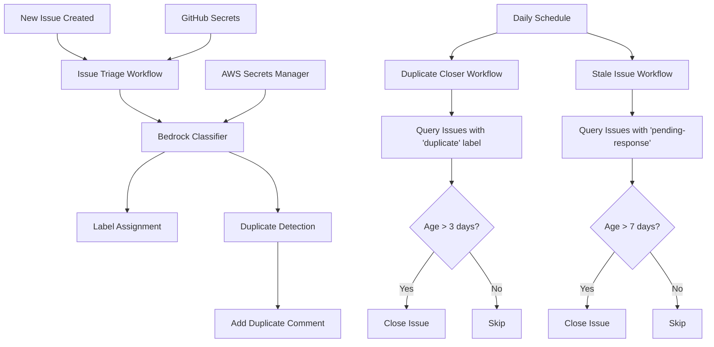

# Design Document: GitHub Issue Automation

## Overview

This design describes an automated GitHub issue management system that leverages AWS Bedrock's Claude Sonnet 4.5 model for intelligent issue classification, duplicate detection, and lifecycle management. The system consists of multiple GitHub Actions workflows that work together to maintain a clean, well-organized issue tracker.

The automation handles four primary workflows:
1. **Issue Triage** - Automatically labels new issues and detects duplicates
2. **Duplicate Closure** - Closes confirmed duplicate issues after a grace period
3. **Stale Issue Management** - Closes inactive issues awaiting user response
4. **Label Management** - Ensures label taxonomy is properly maintained

## Architecture

### High-Level Architecture



### Component Architecture

The system is composed of the following components:

1. **GitHub Actions Workflows** - Orchestration layer that triggers on events and schedules
2. **Bedrock Integration Module** - TypeScript module that interfaces with AWS Bedrock API
3. **Label Assignment Module** - Analyzes AI output and applies appropriate labels
4. **Duplicate Detection Module** - Compares issues and identifies duplicates
5. **Issue Lifecycle Manager** - Handles closing of duplicate and stale issues

## Components and Interfaces

### 1. Issue Triage Workflow

**File:** `.github/workflows/issue-triage.yml`

**Trigger:** `issues` event with `opened` action

**Responsibilities:**
- Fetch issue details (title, body, labels)
- Call Bedrock Classifier with issue content
- Parse AI response for label recommendations
- Apply labels to the issue
- Detect and comment on potential duplicates

**Environment Variables:**
- `AWS_REGION` - AWS region for Bedrock (default: us-east-1)
- `AWS_ACCESS_KEY_ID` - From GitHub Secrets
- `AWS_SECRET_ACCESS_KEY` - From GitHub Secrets
- `GITHUB_TOKEN` - Automatically provided by GitHub Actions

**Outputs:**
- Labels applied to issue
- Comment added if duplicates detected

### 2. Bedrock Classifier Module

**File:** `scripts/classify_issue.ts`

**Interface:**
```typescript
async function classifyIssue(
    issueTitle: string,
    issueBody: string,
    labelTaxonomy: LabelTaxonomy
): Promise<ClassificationResult> {
    /**
     * Classifies an issue using AWS Bedrock Claude Sonnet 4.5.
     * 
     * @param issueTitle - The issue title
     * @param issueBody - The issue body/description
     * @param labelTaxonomy - Object containing available labels by category
     * 
     * @returns ClassificationResult containing:
     *   - recommendedLabels: string[]
     *   - confidenceScores: Record<string, number>
     *   - reasoning: string
     */
}
```

**Bedrock API Configuration:**
- Model ID: `us.anthropic.claude-sonnet-4-20250514-v1:0` (inference profile)
- Max tokens: 2048
- Temperature: 0.3 (for consistent classification)
- Top P: 0.9

**Note:** The system uses AWS Bedrock inference profiles instead of direct model IDs. Inference profiles provide:
- Cross-region routing for higher availability
- Higher throughput and better performance
- Format: `{region}.{provider}.{model-name}-{version}:{profile-version}`

**Prompt Structure:**
```
You are an expert GitHub issue classifier for the Kiro project.

Analyze the following issue and recommend appropriate labels from the taxonomy below.

ISSUE TITLE: {title}
ISSUE BODY: {body}

LABEL TAXONOMY:
{taxonomy}

Provide your response in JSON format:
{
  "labels": ["label1", "label2", ...],
  "confidence": {"label1": 0.95, "label2": 0.87, ...},
  "reasoning": "Brief explanation of label choices"
}
```

### 3. Duplicate Detection Module

**File:** `scripts/detect_duplicates.ts`

**Interface:**
```typescript
async function detectDuplicates(
    issueTitle: string,
    issueBody: string,
    existingIssues: IssueData[]
): Promise<DuplicateMatch[]> {
    /**
     * Detects duplicate issues using semantic similarity via Bedrock.
     * 
     * @param issueTitle - The new issue title
     * @param issueBody - The new issue body
     * @param existingIssues - Array of existing open issues to compare against
     * 
     * @returns Array of DuplicateMatch objects containing:
     *   - issueNumber: number
     *   - similarityScore: number (0-1)
     *   - reasoning: string
     */
}
```

**Duplicate Detection Strategy:**
1. Fetch all open issues from the repository (excluding the current issue)
2. Filter to issues created in the last 90 days (performance optimization)
3. Use Bedrock to perform semantic similarity analysis in batches of 10
4. Return matches with similarity score > 0.80
5. Sort by similarity score (highest first)

**Prompt Structure:**
```
You are analyzing GitHub issues for duplicates.

NEW ISSUE:
Title: {new_title}
Body: {new_body}

EXISTING ISSUES:
{existing_issues_formatted}

For each existing issue, determine if it's a duplicate of the new issue.
Provide similarity scores (0-1) where:
- 1.0 = Exact duplicate
- 0.8-0.99 = Very likely duplicate
- 0.6-0.79 = Possibly related
- <0.6 = Not a duplicate

Return JSON:
{
  "duplicates": [
    {"issue_number": 123, "score": 0.95, "reason": "..."},
    ...
  ]
}
```

### 4. Label Assignment Module

**File:** `scripts/assign_labels.ts`

**Interface:**
```typescript
async function assignLabels(
    issueNumber: number,
    recommendedLabels: string[],
    githubToken: string
): Promise<boolean> {
    /**
     * Assigns labels to a GitHub issue.
     * 
     * @param issueNumber - The issue number
     * @param recommendedLabels - Array of label names to assign
     * @param githubToken - GitHub API token
     * 
     * @returns True if successful, false otherwise
     */
}
```

**Label Validation:**
- Verify all recommended labels exist in the repository
- Filter out any invalid labels
- Always add "pending-triage" label for new issues
- Add "duplicate" label if duplicates detected

### 5. Duplicate Closer Workflow

**File:** `.github/workflows/close-duplicates.yml`

**Trigger:** 
- Schedule: `cron: '0 0 * * *'` (daily at midnight UTC)
- Manual: `workflow_dispatch`

**Responsibilities:**
- Query all open issues with "duplicate" label
- Check label application date using GitHub API
- Close issues where label has been present for 3+ days
- Add closing comment with reference to original issue

**Query Logic:**
```
is:issue is:open label:duplicate
```

**Closing Comment Template:**
```
This issue has been automatically closed as it appears to be a duplicate of #{original_issue}.

If you believe this is incorrect, please comment on this issue and a maintainer will review it.
```

### 6. Stale Issue Workflow

**File:** `.github/workflows/close-stale.yml`

**Trigger:**
- Schedule: `cron: '0 0 * * *'` (daily at midnight UTC)
- Manual: `workflow_dispatch`

**Responsibilities:**
- Query all open issues with "pending-response" label
- Check last activity date (comments, label changes)
- Close issues with no activity for 7+ days
- Add closing comment explaining inactivity closure

**Query Logic:**
```
is:issue is:open label:pending-response
```

**Activity Check:**
- Last comment date
- Last label change date
- Use the most recent of these dates

**Closing Comment Template:**
```
This issue has been automatically closed due to inactivity. It has been 7 days since we requested additional information.

If you still need help with this issue, please feel free to reopen it or create a new issue with the requested details.
```

## Data Models

### ClassificationResult

```typescript
interface ClassificationResult {
    recommendedLabels: string[];
    confidenceScores: Record<string, number>;
    reasoning: string;
    error?: string;
}
```

### DuplicateMatch

```typescript
interface DuplicateMatch {
    issueNumber: number;
    issueTitle: string;
    similarityScore: number;
    reasoning: string;
    url: string;
}
```

### LabelTaxonomy

```typescript
interface LabelTaxonomy {
    featureComponent: string[];
    osSpecific: string[];
    theme: string[];
    workflow: string[];
    special: string[];
}

const DEFAULT_LABEL_TAXONOMY: LabelTaxonomy = {
    featureComponent: [
        "auth", "autocomplete", "chat", "cli", "extensions", "hooks",
        "ide", "mcp", "models", "powers", "specs", "ssh", "steering",
        "sub-agents", "terminal", "ui", "usability", "trusted-commands",
        "pricing", "documentation", "dependencies", "compaction"
    ],
    osSpecific: [
        "os: linux", "os: mac", "os: windows"
    ],
    theme: [
        "theme:account", "theme:agent-latency", "theme:agent-quality",
        "theme:context-limit-issue", "theme:ide-performance",
        "theme:slow-unresponsive", "theme:ssh-wsl", "theme:unexpected-error"
    ],
    workflow: [
        "pending-maintainer-response", "pending-response",
        "pending-triage", "duplicate", "question"
    ],
    special: [
        "Autonomous agent", "Inline chat", "on boarding"
    ]
};
```

### IssueData

```typescript
interface IssueData {
    number: number;
    title: string;
    body: string;
    createdAt: Date;
    updatedAt: Date;
    labels: string[];
    url: string;
    state: string;
}
```


## Correctness Properties

A property is a characteristic or behavior that should hold true across all valid executions of a system—essentially, a formal statement about what the system should do. Properties serve as the bridge between human-readable specifications and machine-verifiable correctness guarantees.

### Property 1: Bedrock API Invocation

*For any* new issue, when the Issue_Manager processes it, the Bedrock_Classifier should be called with the issue title, body, and complete label taxonomy.

**Validates: Requirements 1.1, 5.5**

### Property 2: Valid Label Assignment

*For any* classification result from Bedrock, all assigned labels should exist in the predefined label taxonomy (feature/component, OS-specific, theme, workflow, or special categories).

**Validates: Requirements 1.2, 1.3, 1.4, 6.6**

### Property 3: Pending Triage Label

*For any* new issue that is processed, the "pending-triage" label should always be added regardless of other label assignments.

**Validates: Requirements 1.5**

### Property 4: Graceful Label Assignment Failure

*For any* label assignment operation that fails, the Issue_Manager should log the error and continue processing without throwing an exception.

**Validates: Requirements 1.6**

### Property 5: Duplicate Detection Invocation

*For any* new issue, the Duplicate_Detector should search existing open issues using Bedrock_Classifier for semantic similarity analysis.

**Validates: Requirements 2.1**

### Property 6: High Confidence Duplicate Commenting

*For any* duplicate detection result with similarity score > 0.80, a comment should be added to the issue listing all potential duplicates with their scores and links.

**Validates: Requirements 2.2, 2.5**

### Property 7: Duplicate Label Assignment

*For any* issue where duplicates are detected (similarity > 0.80), the "duplicate" label should be added to the issue.

**Validates: Requirements 2.3**

### Property 8: No False Duplicate Marking

*For any* issue where no duplicates are detected (all similarity scores ≤ 0.80), no "duplicate" label or duplicate-related comments should be added.

**Validates: Requirements 2.4**

### Property 9: Duplicate Closure Timing

*For any* issue with the "duplicate" label, if the label has been present for exactly 3 days or more, the Duplicate_Closer should close the issue.

**Validates: Requirements 3.1**

### Property 10: Duplicate Closure Comment

*For any* issue closed by Duplicate_Closer, a comment should be added that explains the closure reason and references the original issue number.

**Validates: Requirements 3.2, 3.4**

### Property 11: Duplicate Label Removal Prevention

*For any* issue where the "duplicate" label is removed before 3 days have elapsed, the Duplicate_Closer should not close the issue.

**Validates: Requirements 3.3**

### Property 12: Stale Issue Closure Timing

*For any* issue with the "pending-response" label, if there have been no new comments for more than 7 days, the Stale_Issue_Handler should close the issue.

**Validates: Requirements 4.1**

### Property 13: Stale Closure Comment

*For any* issue closed by Stale_Issue_Handler, a comment should be added explaining the closure due to inactivity and informing the user they can reopen or create a new issue.

**Validates: Requirements 4.2, 4.5**

### Property 14: Activity Reset

*For any* issue with the "pending-response" label, if a new comment is added, the 7-day inactivity timer should be reset and the issue should not be closed.

**Validates: Requirements 4.3**

### Property 15: Pending Response Label Removal Prevention

*For any* issue where the "pending-response" label is removed, the Stale_Issue_Handler should not close the issue regardless of inactivity duration.

**Validates: Requirements 4.4**

### Property 16: Retry with Exponential Backoff

*For any* API call (Bedrock or GitHub) that fails, the system should retry up to 3 times with exponential backoff before giving up.

**Validates: Requirements 5.3, 8.3**

### Property 17: Graceful API Failure

*For any* Bedrock API call that fails after all retries, the Issue_Manager should log the error and continue processing without AI classification rather than failing the entire workflow.

**Validates: Requirements 5.4**

### Property 18: Batch Processing

*For any* workflow run processing multiple issues, issues should be processed in batches to avoid exceeding GitHub API rate limits.

**Validates: Requirements 7.4**

### Property 19: Rate Limit Handling

*For any* workflow run that approaches GitHub API rate limits, the workflow should pause and resume after the rate limit resets.

**Validates: Requirements 7.5**

### Property 20: Comprehensive Error Logging

*For any* workflow step that fails, the Issue_Manager should log detailed error information including the issue number, step name, and error message.

**Validates: Requirements 8.1, 8.2**

### Property 21: Workflow Summary on Critical Failure

*For any* critical failure during workflow execution, the Issue_Manager should create a workflow run summary containing failure details.

**Validates: Requirements 8.4**

### Property 22: Fault Isolation

*For any* workflow run processing multiple issues, if individual issue processing fails, the workflow should continue processing remaining issues rather than failing entirely.

**Validates: Requirements 8.5**

## Error Handling

### API Error Handling

**Bedrock API Errors:**
- Connection timeouts: Retry with exponential backoff (1s, 2s, 4s)
- Rate limiting (ThrottlingException): Wait and retry with backoff
- Authentication errors: Log error, fail workflow (configuration issue)
- Model errors: Log error, continue without AI classification
- Invalid response format: Log error, use fallback classification

**GitHub API Errors:**
- Rate limiting: Check rate limit headers, pause until reset
- Authentication errors: Fail workflow (configuration issue)
- Resource not found: Log warning, skip that resource
- Network errors: Retry with exponential backoff

### Workflow Error Handling

**Issue Processing Errors:**
- If Bedrock classification fails: Continue with manual triage (pending-triage label only)
- If duplicate detection fails: Continue without duplicate checking
- If label assignment fails: Log error, continue (labels can be added manually)
- If comment posting fails: Retry once, then log error and continue

**Batch Processing Errors:**
- Process issues independently
- Track failed issues in workflow summary
- Don't let one failure stop the entire batch

### Error Logging Strategy

All errors should be logged with:
- Timestamp
- Issue number (if applicable)
- Component/module name
- Error type and message
- Stack trace (for unexpected errors)
- Context (what operation was being performed)

Logs should be written to:
- GitHub Actions workflow logs (visible in UI)
- Workflow run summary (for critical errors)

## Testing Strategy

### Unit Testing

Unit tests will verify specific examples and edge cases for individual components:

**Bedrock Classifier Module:**
- Test with sample issue content and verify API call format
- Test prompt construction with label taxonomy
- Test response parsing for various AI output formats
- Test error handling for malformed responses

**Duplicate Detection Module:**
- Test with known duplicate pairs (high similarity)
- Test with unrelated issues (low similarity)
- Test with empty issue lists
- Test similarity score thresholding (0.80 cutoff)

**Label Assignment Module:**
- Test with valid label recommendations
- Test with invalid label names (should filter out)
- Test with empty label lists
- Test GitHub API error handling

**Issue Lifecycle Managers:**
- Test duplicate closure with various label ages
- Test stale issue closure with various inactivity periods
- Test comment formatting and content
- Test label removal scenarios

### Property-Based Testing

Property-based tests will verify universal properties across all inputs using a TypeScript property testing library (fast-check):

**Configuration:**
- Minimum 100 iterations per property test
- Each test tagged with: `// Feature: github-issue-automation, Property {N}: {property_text}`

**Test Generators:**
- Random issue data (titles, bodies with various content)
- Random classification results (labels, confidence scores)
- Random duplicate detection results (similarity scores, issue numbers)
- Random timestamps (for age-based logic)
- Random API error responses

**Property Tests:**

1. **Bedrock API Invocation** - Generate random issues, verify Bedrock is called with correct parameters
2. **Valid Label Assignment** - Generate random classification results, verify only valid labels are assigned
3. **Pending Triage Label** - Generate random issues, verify pending-triage is always added
4. **Graceful Failures** - Generate random errors, verify system continues without crashing
5. **Duplicate Detection** - Generate random issues, verify duplicate detection is invoked
6. **High Confidence Commenting** - Generate random similarity scores, verify comments added when score > 0.80
7. **Duplicate Labeling** - Generate random duplicate results, verify label added when duplicates found
8. **No False Duplicates** - Generate random low-similarity results, verify no duplicate marking
9. **Closure Timing** - Generate random label ages, verify closure happens at correct thresholds
10. **Comment Content** - Generate random closures, verify comments contain required information
11. **Retry Behavior** - Generate random API failures, verify retry logic with exponential backoff
12. **Batch Processing** - Generate random issue batches, verify batching behavior
13. **Error Logging** - Generate random errors, verify logs contain required information
14. **Fault Isolation** - Generate random failures in batch processing, verify workflow continues

### Integration Testing

Integration tests will verify end-to-end workflows:

**Issue Triage Workflow:**
- Create test issue via GitHub API
- Verify workflow triggers
- Verify labels are applied
- Verify duplicate comment if applicable
- Clean up test issue

**Duplicate Closure Workflow:**
- Create test issue with duplicate label (backdated)
- Run workflow manually
- Verify issue is closed
- Verify closing comment
- Clean up

**Stale Issue Workflow:**
- Create test issue with pending-response label (backdated)
- Run workflow manually
- Verify issue is closed
- Verify closing comment
- Clean up

### Testing in CI/CD

**Pre-merge Testing:**
- Run all unit tests
- Run property tests (100 iterations minimum)
- Lint TypeScript code (ESLint)
- Type checking (tsc --noEmit)

**Post-merge Testing:**
- Run integration tests against test repository
- Monitor workflow execution in production
- Alert on workflow failures

### Manual Testing Checklist

Before deploying to production:
- [ ] Create test issue and verify labels are applied correctly
- [ ] Verify duplicate detection works with known duplicate
- [ ] Verify duplicate closure after 3 days
- [ ] Verify stale issue closure after 7 days
- [ ] Verify error handling with invalid AWS credentials
- [ ] Verify rate limit handling with high issue volume
- [ ] Review workflow logs for any warnings or errors
