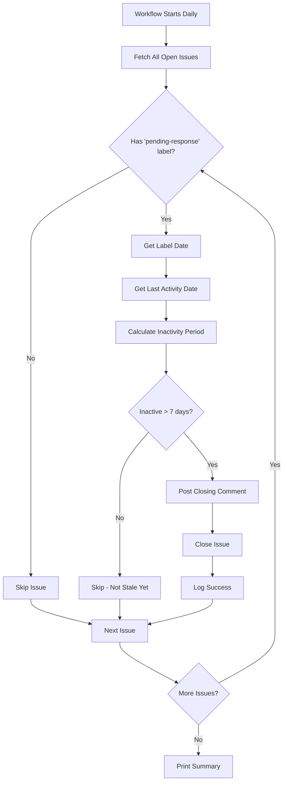

# How Stale Issue Closing Works

## Overview

The stale issue closing system automatically closes issues that have been waiting for a user response for 7+ days without any activity. This keeps the issue tracker clean and focused on actionable items.

## When It Runs

### Automatic Schedule
```yaml
schedule:
  - cron: "0 0 * * *"  # Daily at midnight UTC
```

**Frequency:** Once per day at midnight UTC

**Why daily?** 
- Checks issues consistently
- Not too aggressive (gives users time to respond)
- Low resource usage

### Manual Trigger
```yaml
workflow_dispatch: # Allow manual trigger
```

You can also run it manually:
```bash
gh workflow run close-stale.yml
```

## What It Does

### Step-by-Step Process



### 1. Find Candidate Issues

```typescript
const { data: issues } = await client.issues.listForRepo({
  owner,
  repo,
  state: "open",
  labels: "pending-response",
  per_page: 100,
});
```

**Query:** Find all open issues with the `pending-response` label

**Why this label?**
- Indicates maintainer is waiting for user to provide information
- User was asked to respond but hasn't yet
- Issue cannot progress without user input

**Example scenarios:**
- "Please provide your OS version and error logs"
- "Can you try this workaround and let us know if it works?"
- "We need more details to reproduce this issue"

### 2. Check Each Issue

For each issue found, the system performs several checks:

#### Check 1: Verify Label Still Exists

```typescript
const hasPendingResponseLabel = issue.labels.some(
  (label) => label.name === "pending-response"
);

if (!hasPendingResponseLabel) {
  console.log(`Skipped: pending-response label was removed`);
  continue;
}
```

**Why?** Label might have been removed between query and processing

**Result:** Skip if label was removed (user may have responded)

#### Check 2: Get Label Application Date

```typescript
async function getPendingResponseLabelDate(
  client: Octokit,
  owner: string,
  repo: string,
  issueNumber: number
): Promise<Date | null> {
  const { data: events } = await client.issues.listEvents({
    owner,
    repo,
    issue_number: issueNumber,
    per_page: 100,
  });

  // Find the most recent "labeled" event for "pending-response"
  const labelEvent = events
    .filter(
      (event) =>
        event.event === "labeled" &&
        event.label &&
        event.label.name === "pending-response"
    )
    .sort(
      (a, b) =>
        new Date(b.created_at).getTime() - new Date(a.created_at).getTime()
    )[0];

  return labelEvent ? new Date(labelEvent.created_at) : null;
}
```

**What it does:**
1. Fetches all timeline events for the issue
2. Filters for "labeled" events
3. Finds the most recent "pending-response" label addition
4. Returns the date when label was added

**Why most recent?** Label might have been removed and re-added

#### Check 3: Get Last Activity Date

```typescript
async function getLastActivityDate(
  client: Octokit,
  owner: string,
  repo: string,
  issueNumber: number
): Promise<Date | null> {
  // Get comments
  const { data: comments } = await client.issues.listComments({
    owner,
    repo,
    issue_number: issueNumber,
    per_page: 100,
    sort: "created",
    direction: "desc",
  });

  // Get timeline events (for label changes)
  const { data: events } = await client.issues.listEvents({
    owner,
    repo,
    issue_number: issueNumber,
    per_page: 100,
  });

  const dates: Date[] = [];

  // Add comment dates
  if (comments.length > 0) {
    dates.push(new Date(comments[0].created_at));
  }

  // Add label event dates
  const labelEvents = events.filter(
    (event) => event.event === "labeled" || event.event === "unlabeled"
  );
  if (labelEvents.length > 0) {
    dates.push(new Date(labelEvents[labelEvents.length - 1].created_at));
  }

  // Return most recent date
  if (dates.length > 0) {
    return new Date(Math.max(...dates.map((d) => d.getTime())));
  }

  return null;
}
```

**What counts as activity:**
1. **New comments** - User or maintainer added a comment
2. **Label changes** - Any label was added or removed

**Why track activity?**
- If user responds with a comment, reset the timer
- If maintainer changes labels, issue is being actively managed
- Prevents closing issues that are being worked on

#### Check 4: Calculate Inactivity Period

```typescript
// Use the most recent date (label date or last activity)
const referenceDate = lastActivityDate && lastActivityDate > labelDate
  ? lastActivityDate
  : labelDate;

const inactiveMs = now.getTime() - referenceDate.getTime();
const inactiveDays = inactiveMs / (24 * 60 * 60 * 1000);

console.log(`Inactive for: ${inactiveDays.toFixed(1)} days`);
```

**Logic:**
1. Compare label date vs last activity date
2. Use whichever is more recent
3. Calculate days since that date
4. Log for transparency

**Example Timeline:**

```
Day 0:  Issue created
Day 1:  Maintainer adds "pending-response" label (labelDate = Day 1)
Day 3:  User adds comment (lastActivityDate = Day 3)
Day 10: Workflow runs

Reference Date = Day 3 (most recent)
Inactive Days = 7 days
Result: Close the issue ✅
```

**Another Example:**

```
Day 0:  Issue created
Day 1:  Maintainer adds "pending-response" label (labelDate = Day 1)
Day 5:  User adds comment (lastActivityDate = Day 5)
Day 10: Workflow runs

Reference Date = Day 5 (most recent)
Inactive Days = 5 days
Result: Skip - not stale yet ⏳
```

#### Check 5: Close If Stale

```typescript
const DAYS_THRESHOLD = 7;
const thresholdMs = DAYS_THRESHOLD * 24 * 60 * 60 * 1000;

if (inactiveMs >= thresholdMs) {
  // Close the issue
  const closed = await closeStaleIssue(
    client,
    owner,
    repo,
    issue.number
  );
  
  if (closed) {
    closedCount++;
  }
} else {
  console.log(`Skipped: not inactive long enough (needs ${DAYS_THRESHOLD} days)`);
  skippedCount++;
}
```

**Threshold:** 7 days (configurable via `DAYS_THRESHOLD` constant)

**Why 7 days?**
- Gives users a full week to respond
- Not too aggressive (users have time)
- Not too lenient (keeps tracker clean)
- Industry standard for stale issues

### 3. Close the Issue

```typescript
async function closeStaleIssue(
  client: Octokit,
  owner: string,
  repo: string,
  issueNumber: number
): Promise<boolean> {
  const comment = `This issue has been automatically closed due to inactivity. It has been 7 days since we requested additional information.

If you still need help with this issue, please feel free to reopen it or create a new issue with the requested details.`;

  // Post closing comment
  await retryWithBackoff(async () => {
    await client.issues.createComment({
      owner,
      repo,
      issue_number: issueNumber,
      body: comment,
    });
  });

  // Close the issue
  await retryWithBackoff(async () => {
    await client.issues.update({
      owner,
      repo,
      issue_number: issueNumber,
      state: "closed",
    });
  });

  console.log(`✓ Closed issue #${issueNumber} due to inactivity`);
  return true;
}
```

**Process:**
1. **Post comment** explaining why issue is being closed
2. **Close the issue** (state: "closed")
3. **Log success** for monitoring

**Comment includes:**
- ✅ Reason for closure (inactivity)
- ✅ How long it's been (7 days)
- ✅ Instructions to reopen or create new issue
- ✅ Friendly, helpful tone

## Configuration

### Adjusting the Threshold

To change from 7 days to a different value:

```typescript
// In scripts/close_stale.ts
const DAYS_THRESHOLD = 14;  // Change to 14 days
```

Then rebuild:
```bash
cd scripts
npm run build
```

### Adjusting the Schedule

To change when the workflow runs:

```yaml
# In .github/workflows/close-stale.yml
schedule:
  - cron: "0 0 * * *"  # Daily at midnight UTC
```

**Common schedules:**
- `0 0 * * *` - Daily at midnight
- `0 */12 * * *` - Every 12 hours
- `0 0 * * 1` - Every Monday at midnight
- `0 0 1 * *` - First day of each month

## Example Scenarios

### Scenario 1: User Never Responds

```
Day 0:  User creates issue: "App crashes on startup"
Day 1:  Maintainer responds: "Please provide error logs"
Day 1:  Maintainer adds "pending-response" label
Day 2-7: No activity
Day 8:  Workflow runs → Issue closed ✅

Comment: "This issue has been automatically closed due to inactivity..."
```

### Scenario 2: User Responds in Time

```
Day 0:  User creates issue: "App crashes on startup"
Day 1:  Maintainer responds: "Please provide error logs"
Day 1:  Maintainer adds "pending-response" label
Day 4:  User responds: "Here are the logs: ..."
Day 8:  Workflow runs → Issue NOT closed ⏳

Reason: Last activity was Day 4, only 4 days ago
```

### Scenario 3: Label Removed

```
Day 0:  User creates issue: "App crashes on startup"
Day 1:  Maintainer adds "pending-response" label
Day 3:  Maintainer removes "pending-response" label (issue is being worked on)
Day 8:  Workflow runs → Issue NOT closed ⏳

Reason: No longer has "pending-response" label
```

### Scenario 4: Multiple Interactions

```
Day 0:  User creates issue
Day 1:  Maintainer adds "pending-response" label
Day 3:  User responds
Day 5:  Maintainer responds, keeps "pending-response" label
Day 10: Workflow runs → Issue NOT closed ⏳

Reason: Last activity was Day 5, only 5 days ago
```

## Monitoring

### Workflow Logs

Check the Actions tab for each run:

```
=== Closing Stale Issues ===
Repository: owner/repo

Found 5 open issue(s) with pending-response label

Processing issue #123: App crashes on startup
  Inactive for: 8.2 days
✓ Closed issue #123 due to inactivity

Processing issue #456: Login fails
  Inactive for: 3.1 days
  Skipped: not inactive long enough (needs 7 days)

=== Summary ===
Closed: 1
Skipped: 4
Total: 5
```

### Workflow Summary

Each run creates a summary:

```markdown
## Stale Issue Closer Summary
Status: success
Run time: 2026-01-14 00:00:00 UTC
```

## Best Practices

### For Maintainers

1. **Use "pending-response" label consistently**
   - Add when waiting for user information
   - Remove when user responds or issue is being worked on

2. **Be clear in requests**
   - Specify exactly what information is needed
   - Give users clear instructions

3. **Monitor the workflow**
   - Check logs regularly
   - Verify issues are being closed appropriately

4. **Adjust threshold if needed**
   - 7 days might be too short for some projects
   - Consider your community's response time

### For Users

1. **Respond promptly**
   - You have 7 days to provide requested information
   - Any comment resets the timer

2. **Provide complete information**
   - Include all requested details
   - Helps maintainers help you faster

3. **Reopen if needed**
   - If issue was closed but you still need help
   - Just reopen and provide the requested information

## Error Handling

### Retry Logic

```typescript
await retryWithBackoff(async () => {
  await client.issues.createComment({...});
});
```

**Features:**
- Retries up to 3 times
- Exponential backoff (1s, 2s, 4s)
- Handles network errors and rate limits

### Graceful Degradation

```typescript
try {
  // Process issue
} catch (error) {
  console.error(`Error closing issue #${issueNumber}:`, error);
  return false;  // Continue with next issue
}
```

**Behavior:**
- Errors don't stop the entire workflow
- Failed issues are logged
- Other issues continue processing

## Permissions Required

```yaml
permissions:
  issues: write   # Can close issues and add comments
  contents: read  # Can read repository files
```

**Why these permissions:**
- `issues: write` - Required to close issues and post comments
- `contents: read` - Required to access TypeScript scripts

## Cost & Performance

### GitHub API Calls

Per issue:
- 1 call to list comments
- 1 call to list events
- 1 call to post comment (if closing)
- 1 call to close issue (if closing)

**Total:** ~4 API calls per issue

### Rate Limits

GitHub API rate limit: 5,000 requests/hour

**Capacity:** Can process ~1,250 issues per run (well within limits)

### Execution Time

- ~1-2 seconds per issue
- 100 issues = ~2-3 minutes total

## Summary

The stale issue closing system:

✅ **Runs daily** at midnight UTC
✅ **Finds issues** with "pending-response" label
✅ **Checks activity** (comments and label changes)
✅ **Closes after 7 days** of inactivity
✅ **Posts helpful comment** explaining closure
✅ **Handles errors gracefully** without failing
✅ **Logs everything** for transparency
✅ **Respects user activity** (resets timer on comments)

**Goal:** Keep the issue tracker clean and focused on actionable items while giving users adequate time to respond.
